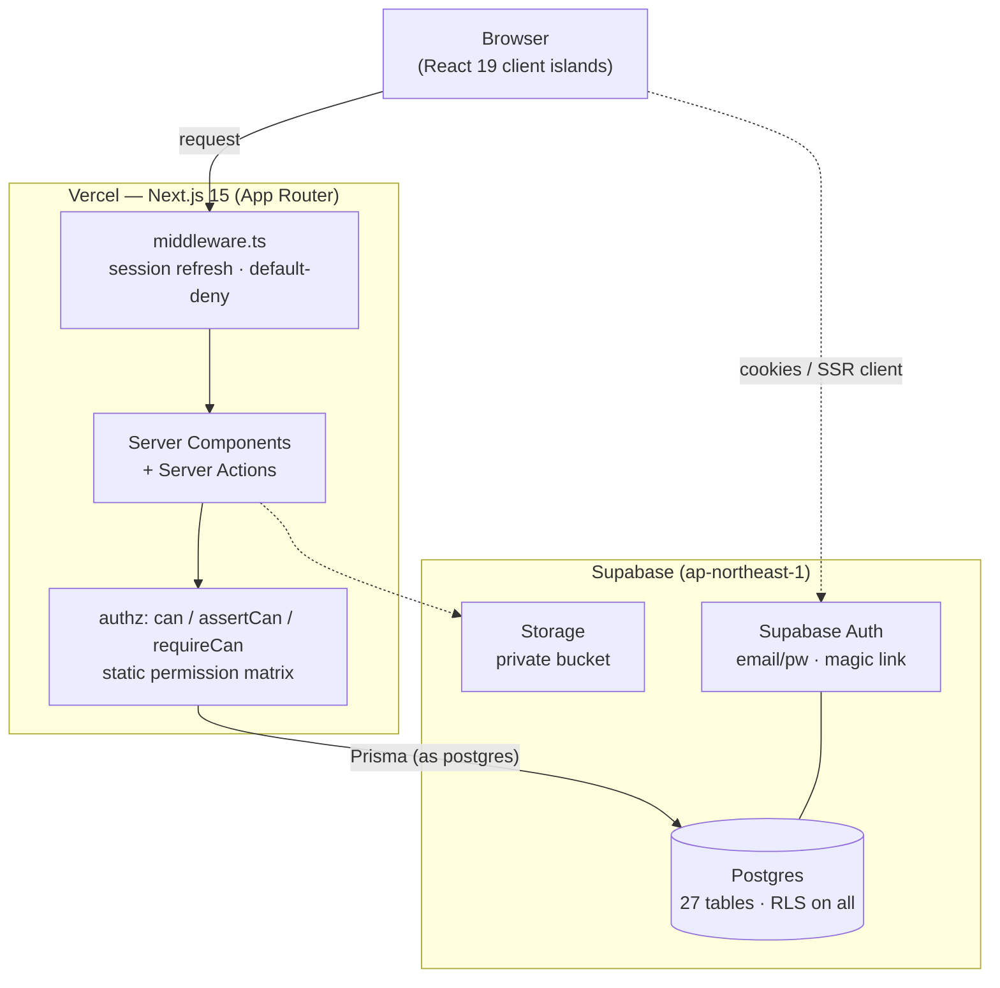
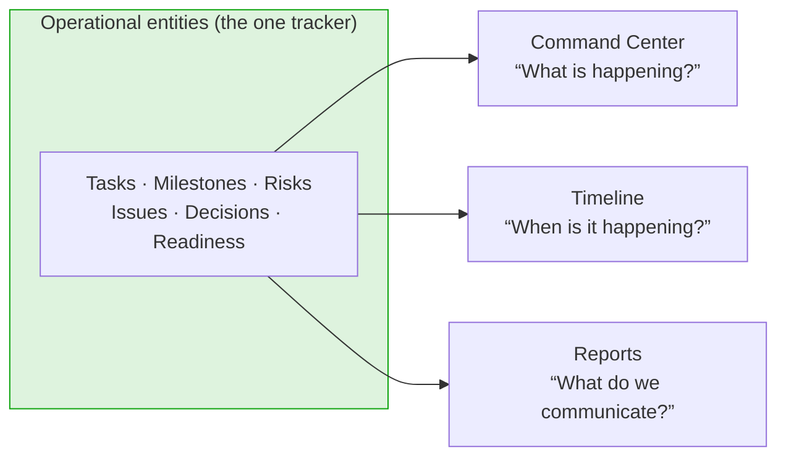
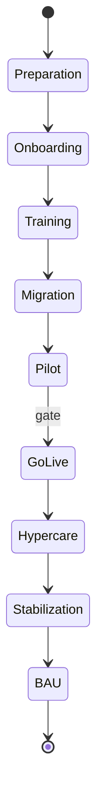

<div align="center">

# Rollout OS

**The operational workspace for enterprise rollouts.**
Plan, track, and govern staggered, multi-tenant software rollouts from a single source of truth.

[](./.github/workflows/ci.yml)
[](https://nextjs.org)
[](https://www.typescriptlang.org)
[](https://supabase.com)
[](./LICENSE)

[Problem](#the-problem) · [Product](#the-product) · [Screens](#screens) · [Architecture](#architecture) · [Quickstart](#quickstart) · [Deployment](#deployment) · [Docs](#documentation) · [Roadmap](#roadmap) · [Philosophy](#philosophy)

</div>

---

## The problem

Enterprise rollouts — standing up a platform, migrating an ERP, launching across regions, delivering a multi-partner programme — are temporary, cross-functional, and volatile. During a rollout, the information that explains it fragments across a dozen systems: tasks in one tool, decisions in email, risks in a spreadsheet, status in someone's head, timelines in a deck.

Every one of those tools does its own job well. **None of them explains the rollout as a whole.** So the same failure mode repeats on every programme:

- Project managers spend their week _manually assembling_ status instead of delivering.
- Leadership can't see real progress without asking for an update.
- Risks and blockers surface late, in meetings, instead of the moment they appear.
- Every team keeps its own private copy of "the truth," and they drift.

Despite decades of project-management software, there is still no operational workspace built _specifically_ for the rollout phase. Rollout OS is that workspace.

## The product

Rollout OS is a **domain-agnostic** platform for running staggered, multi-tenant rollouts — one product being stood up across many teams, partners, or customers, where each unit advances independently through a defined delivery lifecycle. It generalizes the "one tracker → everything derived" operating model into a reusable product.

Six pillars define it:

| Pillar                          | What it means                                                                                                                                                                                          |
| ------------------------------- | ------------------------------------------------------------------------------------------------------------------------------------------------------------------------------------------------------ |
| **Configurable lifecycle**      | A definable state machine (Preparation → Onboarding → Training → Migration → Pilot → Go Live → Hypercare → Stabilization → BAU), with gates between stages. Stages are _configuration_, not hardcoded. |
| **Rollout unit grid**           | One row per _Workstream × Tenant_, each advancing on its own timeline.                                                                                                                                 |
| **Single source of truth**      | Status lives in exactly one place. Dashboards, timelines, and reports are pure _projections_ of it — never re-entered by hand.                                                                         |
| **Unified action register**     | Actions, issues, risks, and decisions in one place, prioritized by SLA.                                                                                                                                |
| **Governance & cadence engine** | Configurable meeting rhythms, escalation tiers, and exit criteria.                                                                                                                                     |
| **Terminology layer**           | Every label (_tenant_, _workstream_, _stage_) is relabelable per vertical — no domain concept is baked into the schema.                                                                                |

> **Why the model is domain-agnostic.** An Amazon CSR programme was the _design partner_ we reverse-engineered the reusable model from — **not** the product. Nothing domain-specific (a partner, a programme, a date) is ever hardcoded; it is always config or seed data. See [`/decisions`](#decisions) for the reasoning behind this and the other founding choices.

### Status

**MVP feature-complete.** The application is built and running on live Supabase:

- ✅ **Auth** — email/password + magic link + password reset, default-deny middleware, rate limiting, private storage bucket.
- ✅ **Domain schema** — 27 tables, Row-Level Security on every one, Prisma-owned migrations.
- ✅ **Authorization** — 7 org-scoped roles + super-admin, static permission matrix, experience profiles kept separate from RBAC.
- ✅ **Onboarding** — create organization → create first rollout (seeds phases + readiness dimensions) → Command Center.
- ✅ **Command Center** + all **seven lifecycle modules** — Programs, Workstreams, Operations, Knowledge, Timeline, Reports, Administration — wired to live data.
- ✅ **Audit trail** — every mutation appends to an activity log.
- ✅ **Ship prep** — CSP header (report-only), Vercel config, production env guards.

What's next is in the [roadmap](#roadmap); what's _deliberately_ not built yet (and why) is in the [decision log](#decisions).

## Screens

> 🎥 **Screenshots and walkthrough GIFs are captured separately** — the app requires an authenticated session against live Supabase, so images aren't committed to keep the repo lean. To capture your own after [Quickstart](#quickstart):

| Screen         | Route         | What it shows                                                                        |
| -------------- | ------------- | ------------------------------------------------------------------------------------ |
| Command Center | `/`           | Vital signs (health · progress · readiness · go-live countdown) + five live sections |
| Programs       | `/programs`   | Deliverables list, quick-create, detail template                                     |
| Operations     | `/operations` | Tasks · Milestones · Risks · Issues · Decisions in one tabbed workspace              |
| Timeline       | `/timeline`   | Phase-ordered projection with go-live marker                                         |
| Reports        | `/reports`    | Executive · Weekly · Risk · Readiness, generated from operational data               |
| Administration | `/settings`   | Members, roles, manual health & readiness                                            |

_Capture checklist: sign up → onboard a demo org → seed a rollout → screenshot each route above in light and dark theme. Drop images under `docs/assets/` and link them here._

## Architecture

Server-first Next.js. The browser talks only to Server Components and Server Actions; all data access and every authorization check happen on the server, against Postgres, through Prisma.



**Single source of truth → projections.** Status is written once, on the operational entities. Every other surface is a read-only derivation of that state — which is why the Command Center, Timeline, and Reports can never disagree with each other.



**The lifecycle is a configurable state machine** — these stages are the default seed, not hardcoded logic:



For the code-level architecture (folder layout, conventions, quality gates) see **[ARCHITECTURE.md](./ARCHITECTURE.md)**. For the product architecture (domain model, operational models) see **[docs/04](./docs/04_architecture_specification.md)**.

### Tech stack

| Layer                     | Choice                                                                            |
| ------------------------- | --------------------------------------------------------------------------------- |
| Framework                 | Next.js 15 (App Router, React 19, Server Components)                              |
| Language                  | TypeScript (strict)                                                               |
| Styling                   | Tailwind CSS v4 · shadcn/ui (new-york, neutral) · lucide-react                    |
| Data / server state       | TanStack Query v5 · TanStack Table v8                                             |
| Forms & validation        | React Hook Form · Zod                                                             |
| ORM / migrations          | Prisma                                                                            |
| Database / Auth / Storage | Supabase (Postgres + Auth + Storage)                                              |
| Hosting                   | Vercel                                                                            |
| Quality                   | ESLint · Prettier · Vitest · Husky · lint-staged · commitlint · GitHub Actions CI |
| Runtime                   | Node `>= 22` (see [`.nvmrc`](./.nvmrc))                                           |

## Quickstart

**Prerequisites:** Node `>= 22` (run `nvm use`), npm `>= 11`, and a Supabase project (free tier is fine — see [SETUP.md](./SETUP.md)).

```bash
git clone https://github.com/ftmanhladhw/rollout-os.git
cd rollout-os
nvm use                 # Node 22 (see .nvmrc)
npm install             # installs deps + generates the Prisma client + git hooks
cp .env.example .env    # then fill in your Supabase / database values
npm run db:migrate      # apply the schema to your database
npm run dev             # http://localhost:3000
```

First run drops you at `/login`. Sign up, and onboarding walks you through creating an organization and your first rollout. The full backend runbook (Supabase project, auth templates, storage, RLS) is in **[SETUP.md](./SETUP.md)**.

### Everyday scripts

| Script                                     | Purpose                                                                      |
| ------------------------------------------ | ---------------------------------------------------------------------------- |
| `npm run dev`                              | Next.js dev server                                                           |
| `npm run build` / `npm run start`          | Production build / serve it                                                  |
| `npm run check`                            | **Run every gate** (format · lint · typecheck · test · build) before pushing |
| `npm run lint` / `npm run lint:fix`        | ESLint                                                                       |
| `npm run format` / `npm run format:check`  | Prettier write / verify                                                      |
| `npm run typecheck`                        | `tsc --noEmit`                                                               |
| `npm test` / `npm run test:watch`          | Vitest                                                                       |
| `npm run db:migrate` / `db:migrate:deploy` | Prisma migrate (dev / prod)                                                  |
| `npm run db:studio`                        | Prisma Studio                                                                |

## Deployment

The repo is deploy-ready for Vercel: `vercel.json` colocates functions with the Supabase region, `next.config.ts` sets security headers and image formats, and `src/lib/env.ts` refuses a production boot on a misconfigured `NEXT_PUBLIC_SITE_URL`. The end-to-end runbook — environment variables, the manual-migration rule (`db:migrate:deploy`), Supabase URL configuration, and the post-deploy checklist — is **[SETUP.md §8](./SETUP.md)**.

## Documentation

Everything lives under [`/docs`](./docs), indexed in **[docs/README.md](./docs/README.md)**. Highlights:

| Doc                                        | For                                                                      |
| ------------------------------------------ | ------------------------------------------------------------------------ |
| [ARCHITECTURE.md](./ARCHITECTURE.md)       | Code architecture, folder layout, conventions                            |
| [docs/02–07](./docs)                       | Product thinking: thesis, vision, architecture spec, IA, PRD, UX spec    |
| [docs/09](./docs/09_database_design.md)    | Database design (schema, RLS, conventions)                               |
| [docs/14](./docs/14_auth_authorization.md) | Auth & authorization model                                               |
| [docs/13](./docs/13_decision_log.md)       | Engineering decision log (mirrored in-app at [`/decisions`](#decisions)) |
| [SETUP.md](./SETUP.md)                     | Supabase + Vercel runbook                                                |
| [HANDOFF.md](./HANDOFF.md)                 | One-file orientation for picking the project up                          |

<a id="decisions"></a>

### Decision log

The most consequential product choices — _why Rollout OS is not a project-management tool, why the Command Center is the primary experience, why health and readiness are manual, why AI is excluded from v1_ — are documented as an engineering decision log, in [docs/13](./docs/13_decision_log.md) and live in the app at **`/decisions`**. It records decisions, not features: each with its problem, alternatives, trade-offs, and future implications.

## Roadmap

Full detail in **[docs/12](./docs/12_product_roadmap.md)**. In brief:

- **Now (MVP, done):** auth, domain schema + RLS, authorization, onboarding, Command Center, all seven modules, audit trail, ship prep.
- **Next:** first Vercel deploy · custom SMTP for auth email · promote CSP from report-only to enforcing · design-system pass (docs/08).
- **Later:** organization invite flow (today a second user creates their own org) · configurable lifecycle & terminology editing in-product · saved report exports · the multi-tenant rollout-unit grid at scale.
- **Exploratory:** AI assistance — _intentionally excluded from v1_ (see the [decision log](#decisions)).

## Contributing

Branch → PR → green CI → merge; never push to `main`. Conventional Commits are enforced by a `commit-msg` hook and again in CI. Before opening a PR, `npm run check` must pass. The full workflow, commit format, and quality-gate table are in **[CONTRIBUTING.md](./CONTRIBUTING.md)**.

## Philosophy

- **One source of truth, everything else derived.** If a number appears in two places, exactly one of them owns it; the other reads it. No hand-maintained status.
- **Config over code.** Domain concepts — stages, terminology, roles — are data, not `if` statements. The product must fit a vertical it's never seen.
- **Server-first, secure by default.** Authorization is explicit in application code on every mutation; RLS backstops it at the database. Denied is the default; access is granted deliberately.
- **Say why it's empty.** Every empty state explains what will fill it and what comes next — never a bare "no data."
- **Readable over clever.** The smallest diff that does the job, in the idiom of the surrounding code. Knowledge lives in the repo, not in a chat log.

## License

[MIT](./LICENSE) © Rollout OS Contributors
